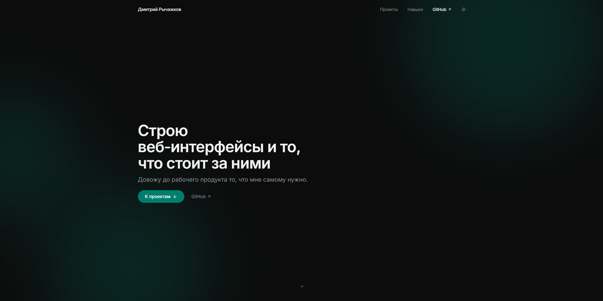

# nekotyan2d.ru

[](https://nekotyan2d.ru)
[](https://github.com/nekotyan2d/nekotyan2d.ru/actions/workflows/build.yml)

Личный сайт-портфолио. Минимализм, светлая и темная темы, анимированный glow-фон на hero, анимации появления при скролле.



## Стек

- **Nuxt 4** (SSG) + Vue 3, TypeScript
- **SCSS** + CSS-переменные для тем
- **GSAP** — анимации, ScrollTrigger
- **@nuxt/fonts** (self-host Inter), **@nuxt/icon**, **@nuxtjs/color-mode**

## Разработка

```bash
bun install
bun run dev # http://localhost:3000
```

## Сборка

```bash
bun run generate # статика в .output/public
```

## Docker

```bash
docker build -t nekotyan2d .
docker run --rm -p 8080:80 nekotyan2d   # http://localhost:8080
```
